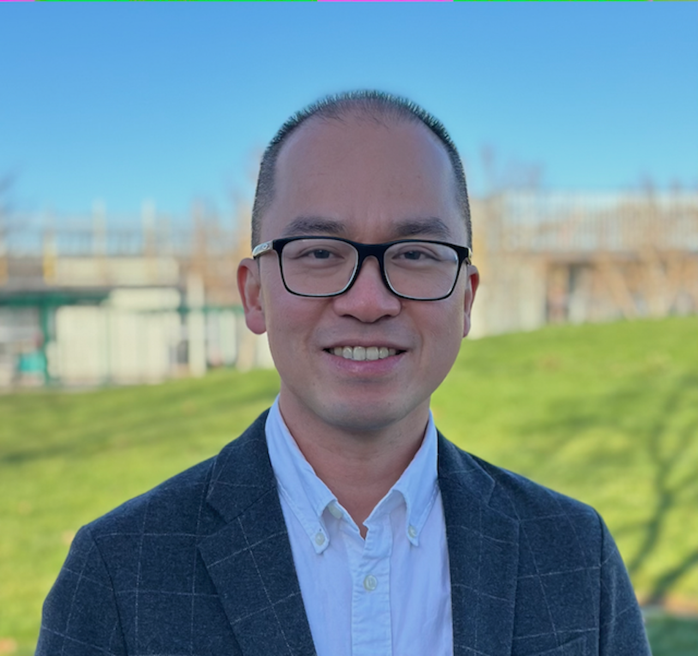
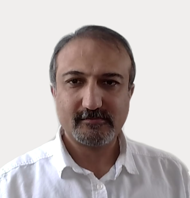
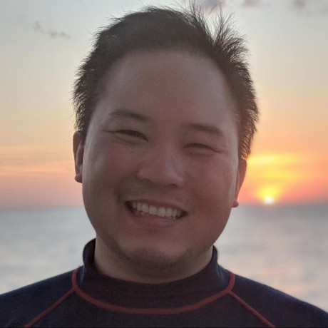

## About the Hackathon

We are excited to host a **Pharmaverse Hackathon** as part of R/Medicine 2026! This is a collaborative event where participants contribute to open-source R packages in the [pharmaverse](https://pharmaverse.org/){target="_blank"} ecosystem, a collection of packages designed to support clinical reporting workflows in the pharmaceutical industry.

Whether you're new to open source or a seasoned contributor, there's a track for you.

::: {.callout-tip}
## Focus: the teal Package
This hackathon will focus specifically on the [teal](https://insightsengineering.github.io/teal/latest-tag/){target="_blank"} package, a framework for building interactive exploratory data analysis applications in clinical trials. All issues and features during the hackathon will be related to {teal}, and **two of the package's developers will be present** throughout the event to guide and support participants.
:::

Use the link below to sign up for the hackathon. You will then receive a Zoom link to join. 

<button class="btn btn-primary"

style = "background-color: #009473"

onclick="window.location.href='https://zoom.us/meeting/register/Xd8TldoLS12ETPBVRcYY6w'">

  **SIGN UP FOR THE HACKATHON**

</button>

*Please note that R/Medicine conference registration is required in order to participate in the hackathon. Register for the conference [here](Register.html).*

## Schedule

| Event | Date | Time (ET) |
|-------|------|-----------|
| **Daniel Chen's Workshop** | Wednesday, April 8th | 11:00 AM -- 1:00 PM |
| **Hackathon Kickoff** | Thursday, April 16th | 11:00 AM -- 12:00 PM |
| **Hackathon** | Thursday, April 23rd | 11:00 AM -- 3:00 PM |

*All times are in Eastern Time (ET).*

## Suggested preparation

* Review the [hackathon prerequisites document](https://drive.google.com/file/d/1mv71Ug29zpbBeJ5bm_Slt61Xkvq2FEQV/view?usp=sharing).

* Recording of Dony Unardi's workshop from R/Medicine 2025 on the [teal package](https://insightsengineering.github.io/teal/latest-tag/)

* Recording of Daniel Chen's workshop, [Make your first R open source project contribution with Git, forks, and PRs](https://www.youtube.com/watch?v=1cIpyi8oX10&list=PL4IzsxWztPdncdf8q6TBT6xT2imoqurxX).
 
* Recording of the hackathon [kickoff meeting](https://youtu.be/RQFcj-X_79s) and the [presented slides](/files/R_Medicine teal Hackathon APR 2026.pdf)

## Meet the Developers

Two of the `teal` package developers will be present throughout the hackathon to guide and support participants.

::: {.workshop-card}
::: {.card-left}
::: {.speaker-imgs}

:::
:::
::: {.card-right}
::: {.workshop-speakers-name}
Dony Unardi
:::
::: {.workshop-desc}
Dony Unardi is a Principal Data Scientist and Engineering Team Lead at Roche/Genentech. He leads development of teal, an open-source R framework for interactive clinical trial data exploration. His work focuses on scalable analytical platforms, reproducible computing, and modern software engineering practices that enable data-driven clinical development.
:::
:::
:::

::: {.workshop-card}
::: {.card-left}
::: {.speaker-imgs}

:::
:::
::: {.card-right}
::: {.workshop-speakers-name}
Peyman Eshghi
:::
::: {.workshop-desc}
Peyman Eshghi is a Senior Principal Technical Lead at Johnson & Johnson, with 20 years of experience in R and data science, dedicated to advancing R in regulated industries by promoting robust, reproducible tooling, community collaboration, and best practices in package development and visualization. Peyman specializes in interactive data visualization for pharma and co-leads the PHUSE working group on teal enhancements and cross‑industry adoption.
:::
:::
:::

## Tracks

The hackathon follows two tracks to accommodate different experience levels:

### Track A: Good First Issues

Ideal for **newcomers** to open-source contribution. You'll work on beginner-friendly issues that help you get comfortable with the contribution workflow, forking repos, creating branches, opening pull requests, and more.

### Track B: Feature-Level Issues

For **advanced contributors** ready to tackle more substantial work. Participants in this track will work in pairs or mini-teams on feature-level issues that require deeper understanding of package architecture and R programming.

## Pre-hackathon workshop

To get the most out of the hackathon, we strongly recommend attending the following workshop offered prior to the hackathon.

</button>

 

::: {.workshop-card}
::: {.card-left}
::: {.card-badge-top}
WORKSHOP
:::
::: {.speaker-imgs}

:::
:::

::: {.card-right}
::: {.workshop-speakers-name}
Daniel Chen
:::
::: {.workshop-desc}
**Make your first R open source project contribution with Git, forks, and PRs** 

Wednesday, April 8th, 11:00 AM -- 1:00 PM ET

Git is a foundational tool for version control in open source collaboration, but contributing to a project involves more than just the basics.

In this workshop, you will get a brief introduction to Git fundamentals before diving into the workflows used in open source. Contributing as a non-collaborator adds an extra layer of complexity, your work needs to be reviewed, which means understanding pull requests, branching strategies, and working across forks.

We will start with creating branches and pull requests within your own repositories, then extend these concepts to contributing to external projects using forks. Along the way, you will learn how tools like the {usethis} R package can simplify and streamline this process.

By the end of the workshop, you will be able to fork a repository, make changes in a local branch, and submit a pull request to the original project for maintainer review.
:::
<!-- ::: {.workshop-links} -->
<!-- [Register here](https://r-consortium.org/webinars/make-your-first-r-open-source-project-contribution.html) -->
<!-- ::: -->
:::
:::

## What to Expect

Technical prerequisites, setup instructions, and onboarding materials will be shared during the **Kickoff session** on April 16th and through follow-up communication with registered participants.

## Questions?

If you have questions about the hackathon, reach out to us via our [Contact page](Contact.html).
