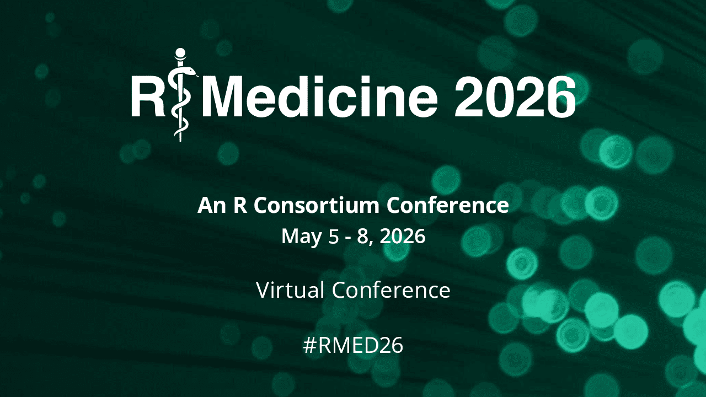
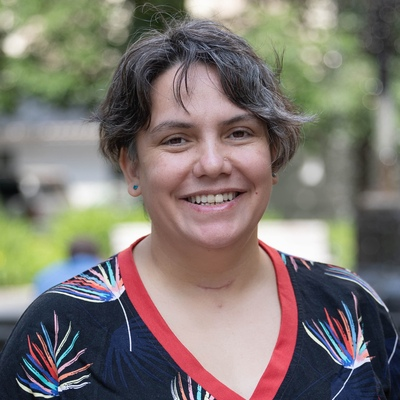
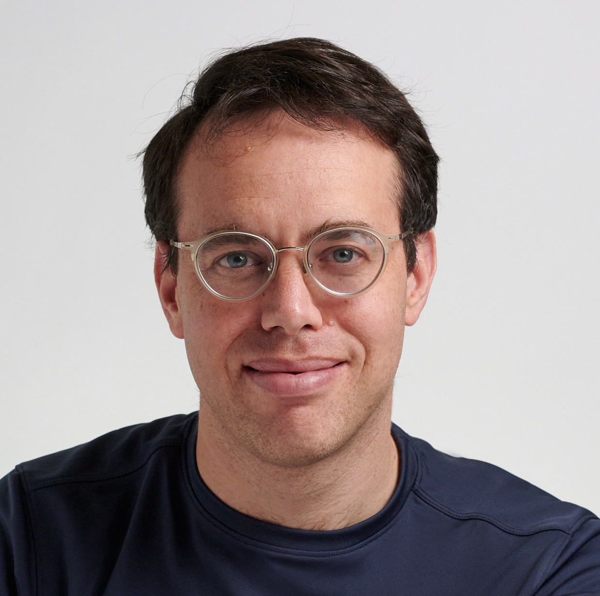
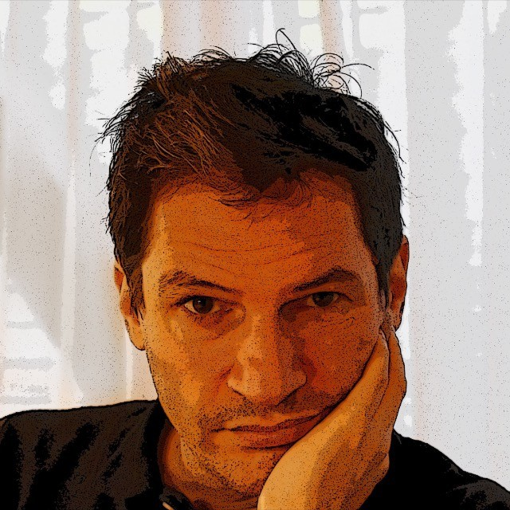
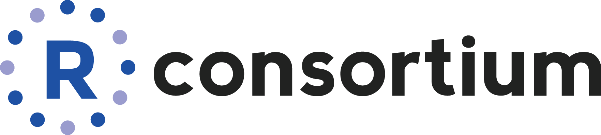

## Why attend

The R/Medicine conference provides a forum for sharing R based tools and approaches used to analyze and 
gain insights from health data. Conference workshops and demos provide a way to learn and develop your 
R skills, and to try out new R packages and tools. Conference talks share new packages, and successes 
in analyzing health, laboratory, and clinical data with R and Shiny, and an opportunity to interact 
with speakers in the chat during their pre-recorded talks.

See below for details on the three keynotes for 2026 - they are not to be missed!

# Keynotes

## Software Sustainability and Community Management {#yanina-bellini}

::: {.workshop-card}
::: {.card-left}
::: {.card-badge-top}
KEYNOTE
:::
::: {.speaker-imgs}

:::
:::

::: {.card-right}
::: {.workshop-speakers-name}
[Yanina Bellini Saibene](https://yabellini.netlify.app){target="_blank"}
:::
::: {.workshop-desc}
**Thursday May 7th, 11:15AM-12:15PM ET**
 

Sustainable software depends as much on people and practices as it does on code. In this talk, I'll draw on my experience leading and supporting R communities to show how intentional community management contributes to long-term software sustainability. Using concrete examples, I'll highlight how communities of practice help distribute maintenance, grow skills, and support inclusive, resilient software ecosystems across research and open source.
:::
::: {.workshop-links}
<!-- [Personal website](https://yabellini.netlify.app){target="_blank"} -->
:::
:::
:::

## Voices in the Code: A Story about People, Their Values, and the Algorithm They Made {#david-robinson}

::: {.workshop-card}
::: {.card-left}
::: {.card-badge-top}
KEYNOTE
:::
::: {.speaker-imgs}

:::
:::

::: {.card-right}
::: {.workshop-speakers-name}
David Robinson
:::
::: {.workshop-desc}
**Thursday May 7th, 3:45-4:45PM ET**
 

Today policymakers and scholars are seeking better ways to share the moral decisionmaking within high stakes software — exploring ideas like public participation, transparency, forecasting, and algorithmic audits. But there are few real examples of those techniques in use. In Voices in the Code, scholar David G. Robinson tells the story of how one community built a life-and-death algorithm in a relatively inclusive, accountable way. Between 2004 and 2014, a diverse group of patients, surgeons, clinicians, data scientists, public officials and advocates collaborated and compromised to build a new transplant matching algorithm – a system to offer donated kidneys to particular patients from the U.S. national waiting list.
:::
::: {.workshop-links}
<!-- [Personal website](INFO HERE){target="_blank"} -->
:::
:::
:::

## The Truth Seekers: Learning How to Assess Generative AI from Professional Sceptics {#peter-gruber}

::: {.workshop-card}
::: {.card-left}
::: {.card-badge-top}
KEYNOTE
:::
::: {.speaker-imgs}

:::
:::

::: {.card-right}
::: {.workshop-speakers-name}
[Peter H. Gruber](https://www.abitof.ai/){target="_blank"}
:::
::: {.workshop-desc}
**Friday May 8th, 11:15AM-12:15PM ET**
 

AI assistants and agents have become an indispensable part of knowledge work, despite their known shortcomings such as hallucinations and biases. In “The Truth Seekers”, scholar Peter H. Gruber identifies a veritable Assessment Crisis, insomuch that prompting skills are much more common than experience in assessing the (potentially faulty) output of AI. With his "Trust but Verify" framework, he asserts that the verification problem is not a new one – it has existed for centuries in professions as diverse a judges, doctors, teachers or journalists. He advocates a systematic study of existing assessment frameworks leading to a culture of AI assessment that is inspired by centuries old assessment techniques.
:::
::: {.workshop-links}
<!-- [Personal website](INFO HERE){target="_blank"} -->
:::
:::
:::

## Brought to you by

 

[{fig-alt="R Consortium" width="50%" fig-align="left"}](https://www.r-consortium.org/)

<!-- max-height="150" width="70%" -->

## Help edit this website

This entire website was made using Quarto and R.

If you notice any problems or have any additions please submit a Pull Request to our public [GitHub Repo](https://github.com/RConsortium/RMedicine_website/)