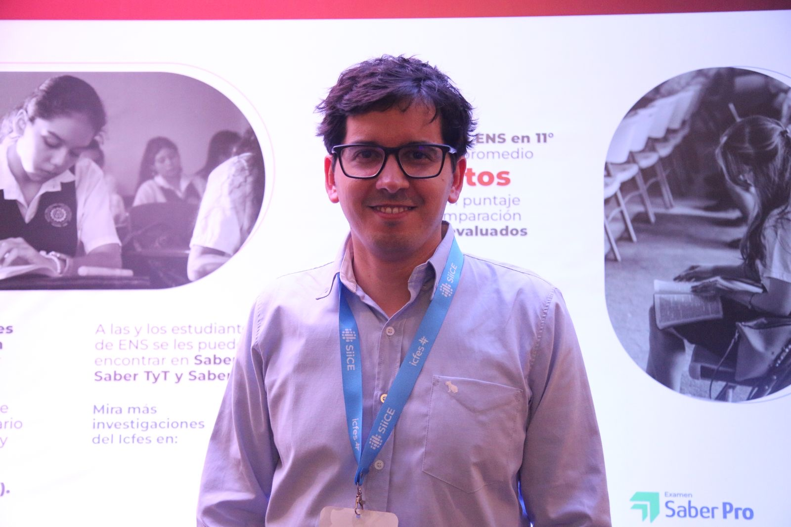
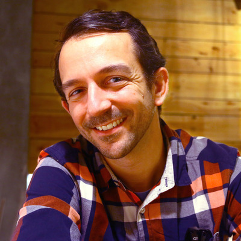

# Workshops

## R101: Introduction to R for Clinical Data {#r101}

::: {.workshop-card}
::: {.card-left}
::: {.card-badge-top}
WORKSHOP
:::
::: {.speaker-imgs}

:::
:::

::: {.card-right}
::: {.workshop-speakers-name}
[Richard Hanna](https://www.linkedin.com/in/richard-hanna-ms-0164162a/){target="_blank"}
:::
::: {.workshop-desc}
A gentle introduction to R and data science for healthcare professionals and clinical researchers.

Rich is a Data Science Supervisor with the Cell and Gene Therapy Informatics Team at the Children’s Hospital of Philadelphia. With a background in biomedical and mechanical engineering, Rich specializes in automating clinical research workflows through advanced analytics and machine learning. His work is pivotal in supporting cell therapy research and enhancing patient care in pediatric medicine
:::
::: {.workshop-links}
[Workshop website](https://hannar1.quarto.pub/rmedicine-101-intro-to-r-for-clinical-data/)

[Workshop pre-work](r101-prework.md)
:::
:::
:::

## Promover la Equidad Científica: Introducción a R {#equidad}

::: {.workshop-card}
::: {.card-left}
::: {.card-badge-top}
WORKSHOP
:::
::: {.speaker-imgs}

:::
:::

::: {.card-right}
::: {.workshop-speakers-name}
[Catalina Cañizares](https://ccani007.github.io/ccani_website/){target="_blank"} & [Francisco Cardozo](https://focardozom.github.io/){target="_blank"}
:::
::: {.workshop-desc}
Este taller ofrece una introducción práctica al uso de R para el análisis de datos en investigación médica y en salud. Está dirigido a profesionales de la salud, investigadores clínicos y estudiantes sin experiencia previa en programación. A lo largo del taller, los participantes aprenderán los conceptos básicos de R, cómo trabajar con bases de datos, realizar análisis descriptivos y generar resultados reproducibles.
:::
::: {.workshop-links}
<!-- [Workshop GitHub repo](INFO HERE) -->
:::
:::
:::

## Mastering Clinical Data Summaries with {gtsummary} and AI {#gtsummary}

::: {.workshop-card}
::: {.card-left}
::: {.card-badge-top}
WORKSHOP
:::
::: {.speaker-imgs}

:::
:::

::: {.card-right}
::: {.workshop-speakers-name}
[Daniel D. Sjoberg](https://www.danieldsjoberg.com/){target="_blank"} & [Shannon Pileggi](https://www.pipinghotdata.com/){target="_blank"}
:::
::: {.workshop-desc}
As the pharmaceutical field moves to open-source solutions for reporting on clinical trials, assessing and vetting the options available becomes increasingly important. The {gtsummary} R package is the most widely used tool in the R ecosystem for creating publication-ready summary tables. Its recent integration with the Analysis Results Dataset (ARD) framework represents a major advance for clinical trial reporting. ARDs, which standardize statistical outputs in a machine-readable format, can be robustly generated using the open-source {cards} package developed by Roche, GSK, Novartis, Eli Lilly, Pfizer, and Clymb.

In this seminar, attendees will learn about ARDs and how can fit into the larger CDISC-proposed Analysis Results Standard, get hands-on experience using {cards} to build ARDs for both simple and complex statistical summaries, create summary tables using the {gtsummary} package, and learn how utilizing these packages together also makes programmatic quality control of TLGs a simple task.

Lastly, we will review how this ecosystem naturally lends itself to Large Language Models (LLMs). Because {gtsummary} is so widely adopted, LLMs can generate complex {gtsummary} code without additional training. Additionally, LLMs can readily interpret our structured ARDs to assist medical writers summarizing both simple and sophisticated trial results.
:::
::: {.workshop-links}
<!-- [Workshop GitHub repo](INFO HERE) -->
:::
:::
:::

## Working with Larger than Memory Data in R {#big-data}

::: {.workshop-card}
::: {.card-left}
::: {.card-badge-top}
WORKSHOP
:::
::: {.speaker-imgs}

:::
:::

::: {.card-right}
::: {.workshop-speakers-name}
[François Michonneau](https://francoismichonneau.net/){target="_blank"}
:::
::: {.workshop-desc}
As datasets continue to grow in size and complexity, R users increasingly encounter data that exceeds their system's memory capacity. This hands-on workshop provides practical strategies for efficiently analyzing larger-than-memory datasets using modern open source tools, with a focus on DuckDB and Apache Arrow—all while maintaining familiar tidyverse workflows.

Participants will learn when and why to move beyond traditional in-memory data frames, and how to choose the right tool for their specific data challenges. Through a combination of presentation and hands-on exercises, we'll explore how DuckDB enables SQL-based analytics on large datasets without loading them entirely into memory, and how Arrow provides a high-performance columnar data format for efficient data interchange and processing. We'll also introduce duckplyr, which brings DuckDB's performance optimizations directly to your existing dplyr code with minimal syntax changes.

The workshop covers essential workflows including reading and querying large CSV and Parquet files, performing aggregations and joins on data that won't fit in RAM, and leveraging duckplyr to accelerate familiar tidyverse operations on larger datasets. Participants will gain practical experience through real-world examples and learn decision frameworks for selecting appropriate tools based on data size, query patterns, and performance requirements—all without abandoning the tidyverse syntax they already know.

Attendees should have basic familiarity with R and the tidyverse. By the end of this 3-hour session, participants will be equipped with reproducible techniques to confidently tackle larger datasets in their own research and data analysis workflows.
:::
::: {.workshop-links}
<!-- [Workshop GitHub repo](INFO HERE) -->
:::
:::
:::

## ggplot2 for Data Visualisation: Creativity, Clarity, Accessibility {#ggplot2}

::: {.workshop-card}
::: {.card-left}
::: {.card-badge-top}
WORKSHOP
:::
::: {.speaker-imgs}

:::
:::

::: {.card-right}
::: {.workshop-speakers-name}
[Cara Thompson](https://www.cararthompson.com/){target="_blank"}
:::
::: {.workshop-desc}
This workshop is designed for ggplot users who know how to make basic graphs, but want to make them look better and save themselves precious time by building reuseable components. We'll explore how to choose the right graphs for different aspects of our data story and how to apply a consistent style across them. In doing so, we will focus on making design choices which are accessible, and on making the most of new ggplot2 features. Because getting from a static graph to an interactive one is much easier than most people realise, we'll finish by exploring how to link two or more interactive graphs together to allow users to explore different aspects of a data story.
This is a code-along workshop, so bring your own data and graphs, and we'll make something fun together!
:::
::: {.workshop-links}
<!-- [Workshop GitHub repo](INFO HERE) -->
:::
:::
:::

## LLMs for Data Analysis in R {#llms}

::: {.workshop-card}
::: {.card-left}
::: {.card-badge-top}
WORKSHOP
:::
::: {.speaker-imgs}

:::
:::

::: {.card-right}
::: {.workshop-speakers-name}
[Sara Altman](https://www.linkedin.com/in/sarakaltman/){target="_blank"}
:::
::: {.workshop-desc}
LLMs are transforming how we write code, build tools, and analyze data. This workshop will introduce participants to programming with LLM APIs in R using ellmer, an open-source package that makes it easy to work with LLMs from R. We'll cover the basics of calling LLMs from R, system prompt design, tool calling, and evaluation, and show how to use LLM-powered tools to support common data analysis tasks like exploratory data analysis. Participants will leave with example scripts they can adapt to their own data analysis projects.
:::
::: {.workshop-links}
<!-- [Workshop GitHub repo](INFO HERE) -->
:::
:::
:::

## Parameterized Reports {#parameterized-reports}

::: {.workshop-card}
::: {.card-left}
::: {.card-badge-top}
WORKSHOP
:::
::: {.speaker-imgs}

:::
:::

::: {.card-right}
::: {.workshop-speakers-name}
[Nicola Rennie](INFO HERE){target="_blank"}
:::
::: {.workshop-desc}
Tired of copying and pasting content from one word document to another each time you write a similar report? Use parameterized reports instead! Parameterized reports allow you write dynamic reports based on input parameters, resulting in more reproducible and quicker reporting. In this workshop, you’ll learn how to write custom {ggplot2} functions to create parameterized plots. You’ll also learn how to create parameterized documents with Quarto, to create multiple versions of HTML documents, Word documents, or PDFs. By the end of the workshop, you’ll be able to create multiple versions of the same report with just one line of code. This workshop is for you if you make similar PDF reports every month, or you want to create the same plot for different subsets of your data, or you just want some {ggplot2} and Quarto tips!
:::
::: {.workshop-links}
[Workshop GitHub repo](https://github.com/nrennie/r-medicine-2026-parameterized-reports)
:::
:::
:::

# Panels

## R and RedCap Panel Discussion {#redcap}

::: {.workshop-card}
::: {.card-left}
::: {.card-badge-top}
PANEL
:::
::: {.speaker-imgs}

:::
:::

::: {.card-right}
::: {.workshop-speakers-name}
[Raymond Balise](INFO HERE){target="_blank"}, [Richard Hanna](INFO HERE){target="_blank"}, [Brandon Rose](INFO HERE){target="_blank"}, others
:::
::: {.workshop-desc}
REDCap has become a cornerstone platform for clinical and translational research, supporting secure data capture for thousands of studies worldwide. As research teams increasingly adopt reproducible, code-driven workflows, R has emerged as a powerful solution for accessing, transforming, and analyzing REDCap data.
Several R packages have been developed to interface with REDCap, each offering distinct approaches to authentication, data retrieval, data transformation, and integration with modern data science workflows. Widely used tools such as [REDCapR](https://ouhscbbmc.github.io/REDCapR/), [REDCapTidieR](https://chop-cgtinformatics.github.io/REDCapTidieR/), [tidyREDCap](https://raymondbalise.github.io/tidyREDCap/), [REDCapSync](https://thecodingdocs.github.io/REDCapSync/), and [RosyREDCap](https://thecodingdocs.github.io/RosyREDCap/) provide alternative strategies for importing REDCap data into R and preparing it for analysis. While these packages share common goals, they differ in philosophy, functionality, and design decisions that influence how researchers might structure their data pipelines.
This panel brings together the developers of these packages to explore the evolving REDCap and R landscape. Panelists will discuss the motivations behind their tools, highlight strengths and trade-offs between approaches, and share perspectives on best practices for reproducible REDCap data workflows. The discussion will also address common challenges faced by researchers working with REDCap data and opportunities for collaboration. 
Audience participation will be encouraged throughout the session and attendees will be invited to share their experiences, identify gaps in existing tooling, and suggest new features that could improve REDCap and R integration.
:::
::: {.workshop-links}
<!-- [Pre-workshop setup](info here.) -->
:::
:::
:::

# Demos

## Building Accessible, On-Brand Documents with Quarto {#quarto-docs}

::: {.workshop-card}
::: {.card-left}
::: {.card-badge-top}
DEMO
:::
::: {.speaker-imgs}

:::
:::

::: {.card-right}
::: {.workshop-speakers-name}
[Charlotte Wickham](https://www.cwick.co.nz/){target="_blank"}
:::
::: {.workshop-desc}
Come see practical strategies for producing Quarto documents that meet organizational standards for both design and accessibility. You’ll learn how to implement consistent organizational branding using brand.yml, plus customization techniques for cases where you need more control. You’ll also learn about recent accessibility improvements for both PDF and HTML outputs.
:::
::: {.workshop-links}
<!-- [Workshop GitHub repo](INFO HERE) -->
:::
:::
:::

## TealFlow Demo {#tealflow}

::: {.workshop-card}
::: {.card-left}
::: {.card-badge-top}
DEMO
:::
::: {.speaker-imgs}

:::
:::

::: {.card-right}
::: {.workshop-speakers-name}
[Marcin Dubel ](INFO HERE){target="_blank"}
:::
::: {.workshop-desc}
Building clinical trial applications with {teal} is powerful but comes with a steep learning curve. In this demo, we'll show why current AI approaches still fall short. They lack the domain context needed and produce frequent errors, even with top models. We'll then walk through TealFlow, our open-source solution that tackles this from two angles: a web-based chat interface designed for non-coders to assemble {teal} dashboards, and TealFlow MCP, a developer tool that plugs into VS Code, Positron, or RStudio to augment your existing workflow. We'll wrap up with our roadmap and ways for the community to contribute.
:::
::: {.workshop-links}
[Demo GitHub repo](https://github.com/Appsilon/tealflow-demo )
:::
:::
:::

## Mapping in R {#mapping}

::: {.workshop-card}
::: {.card-left}
::: {.card-badge-top}
DEMO
:::
::: {.speaker-imgs}

:::
:::

::: {.card-right}
::: {.workshop-speakers-name}
[Anjile An](INFO HERE){target="_blank"}
:::
::: {.workshop-desc}
Data comes in many forms, but the spatial components can be overlooked. You’ll get some history of mapping and learn the basic building blocks of spatial data.  The demo portion will go over how to use the trusty {ggplot2} as well as some new tools like {sf} and {tmap} to plot different types of spatial data. 
:::
::: {.workshop-links}
<!-- [Workshop GitHub repo](INFO HERE) -->
:::
:::
:::

## Ctrialsgov R Package {#ctrialsgov}

::: {.workshop-card}
::: {.card-left}
::: {.card-badge-top}
DEMO
:::
::: {.speaker-imgs}

:::
:::

::: {.card-right}
::: {.workshop-speakers-name}
[Michael Kane](INFO HERE){target="_blank"}
:::
::: {.workshop-desc}
COMING SOON
:::
::: {.workshop-links}
<!-- [Workshop GitHub repo](INFO HERE) -->
:::
:::
:::

## REDCapSync and RosyREDCap: Advanced REDCap API for Even the Basic R User; Standardized Data Pipelines and a Companion Shiny App for any REDCap Project {#redcapdemo}

::: {.workshop-card}
::: {.card-left}
::: {.card-badge-top}
DEMO
:::
::: {.speaker-imgs}

:::
:::

::: {.card-right}
::: {.workshop-speakers-name}
[Brandon Rose](INFO HERE){target="_blank"}, [Natalie Goulett](INFO HERE){target="_blank"}
:::
::: {.workshop-desc}
R and REDCap are both widely utilized in medicine, including basic science, clinical research, and clinal trials. Both have independent strengths, but together they can create powerful data pipelines. Several R packages exist for using however, REDCapSync is the first “get-everything” REDCap R package that is API-efficient and project-agnostic. RosyREDCap is a companion shiny application for exploratory data analysis.  

Using a cache of last project save, a file directory, and the REDCap log, REDCapSync only updates the data that has been changed since the last API call. Each project is maintained as a standardized R6 object that can be used downstream for the best that R has to offer! Furthermore, REDCapSync can be used to upload labelled data using the API, a feature not available on the REDCap website. 

RosyREDCap is an R shiny application that launches a local website for exploratory data analysis of REDCap projects. It is built to load all previous projects that were setup with the REDCapSync package. The user is able to toggle between projects, deidentify data, perform ad-hoc data visualizations, and more.  

Using tools like REDCapSync and RosyREDCap allow even new R users to harness the power of the REDCap API without the burden of learning dozens of API endpoints. During my presentation I will demonstrate the combined strengths of R and REDCap for maintaining strong reproducible clinical data pipelines that can improve clinical research and patient care.
:::
::: {.workshop-links}
<!-- [Workshop GitHub repo](INFO HERE) -->
:::
:::
:::

## Demonstration on making Shiny dashboards accessible for users who rely on screen readers and keyboards {#accessible}

::: {.workshop-card}
::: {.card-left}
::: {.card-badge-top}
DEMO
:::
::: {.speaker-imgs}

:::
:::

::: {.card-right}
::: {.workshop-speakers-name}
[Abigail Stamm](INFO HERE){target="_blank"}, [Eric Kvale](INFO HERE){target="_blank"}
:::
::: {.workshop-desc}
Online dashboards use data visualizations to quickly convey information. Interactive elements like charts and data filters often display additional information not accessible by screen readers. Navigating these elements often relies on a mouse and may not be accessible by keyboard. Accessibility features improve the overall presentation and user experience by adding functionality. These features augment, amplify, and enhance the content so that users can interact with and understand the same content in multiple ways, depending on their needs and preferences.

Our demonstration will cover how to address several accessibility issues in Shiny. We have chosen issues related to screen reader use, keyboard use, and understanding that may be overlooked in sources that cover accessibility in Shiny. We will use an example dashboard that failed several accessibility checks. For each check, we will demonstrate the issue, show a way to revise the dashboard code to address it, and demonstrate how to test it. We estimate 20 minutes of instruction, 15 minutes of live coding, and 15 minutes of demonstration, with 10 minutes for questions at the end.

All files, including the presentation, starting script, and suggested solution script, will be available in the GitHub repository https://github.com/ajstamm/shiny-a11y-app for attendees who wish to code along. Our past presentations on accessibility in Shiny dashboards can also be found here.
:::
::: {.workshop-links}
[Demo GitHub repo](https://github.com/ajstamm/shiny-a11y-app)
:::
:::
:::